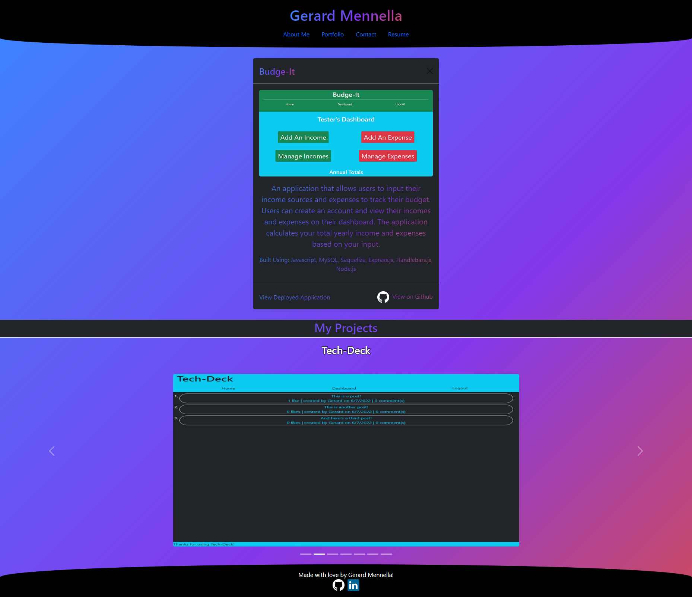

### My Portfolio by Gerard Mennella

# Summary
This application is a portfolio showcasing some of the projects I've created as a software engineer. It is primarily built using react with JSX syntax. A custom CSS stylesheet is utilized alongside bootstrap and npm packages for animations. I built this application using best practices for file structure while maintaining a DRY codebase. My aim was to create a clean, user-friendly UI while incorporating styles and animations to keep the application interesting and easy to navigate. The projects showcased all contain links to their respective deployed pages as well as their github pages.

# Deployed Application
[View Deployed Application](https://gerardmennella21.github.io/my-portfolio/)

# Screenshot
